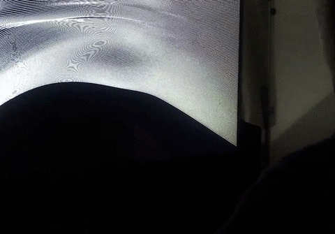

# workshop_code_creatif_1920
This repo holds the code and documentation for the creative coding workshop @lecolededesign. Production were made by students in 2nd year of interaction design using process. The **code** is available [github](https://github.com/AtelierNum/workshop_code_creatif_1920)

Full videos are available [here](https://github.com/AtelierNum/workshop_code_creatif_1920/releases/tag/1.0)

Cette page regroupe les projets réalisés par les étudiants de deuxième année en design d'interaction @lecolededesign. Le code est disponnible sur [github](https://github.com/AtelierNum/workshop_code_creatif_1920)

L'ensemble des vidéos de présentation des projets est disponible [ici](https://github.com/AtelierNum/workshop_code_creatif_1920/releases/tag/1.0)

## Nuance

Réalisé par : **Jade Gagnepain** - **Lison Guignard** - **Morgane Loas** - **Mathis Girard**

Baladez-vous à l’intérieur d’un espace sombre composé de noir et de blanc, pour vivre une expérience interactive, immersive à l’univers épuré et léger, connectée à votre téléphone.
Grâce au téléphone vous pourrez personnaliser votre expérience. À l’aide d’un bouton et de sliders présent sur l’écran du téléphone vous pourrez jouer sur les nuances des animations projetées dans l’installation.

[Cahier de recherche](https://github.com/AtelierNum/workshop_code_creatif_1920/blob/master/Groupe6_Nuance/documentation.pdf)

## Zéphyr

Réalisé par : **Dohyeon Kim** - **Enora Delavigne** - **Marie Sambron** - **Eva Massin** 

“Zéphyr” est une expérience immersive, elle utilise la technologie du Leap Motion (dispositif de détection et d’analyse des gestes de la main) et du code Processing. L’utilisateur doit découvrir et interagir avec diverses animations en utilisant ses mains. 

[Cahier de recherche](https://github.com/AtelierNum/workshop_code_creatif_1920/blob/master/Groupe2_zephyr/documentation.pdf)

## Kyu 

Réalisé par : **Coralie Picard** - **Maël Jallais** - **Martin Fourny** - **Enora Jaffre**

Kyū est une boule rose interactive avec laquelle on peut interagir par le biais de notre téléphone. Cette créature mignonne d’un autre univers rose et fluffy, s’ennuie toute seule, pourquoi ne pas l’aider à se divertir ? Jouez avec elle, et mesurez ses capacités cachées !

[Cahier de recherche](https://github.com/AtelierNum/workshop_code_creatif_1920/blob/master/Groupe1_Kyu/documentation.pdf)

## Gibili

Réalisé par : **Bastien Dennecheau** - **Paco Cailleau** - **Isaac Lefebvre** - **Ayoub Zarafa** 

Cette installation condense humour et technicité, qualités qui carac- térisent la dynamique de notre groupe. Notre installation fait vivre une entité appelée Gibili. Celle-ci interagit avec les spectateurs selon leur nombre, mais nous avons également ajouté un système de cap- teurs AR afin qu’il ai une expression différente pour le porteur. Son objectif est d’occuper un maximum l’espace ambiant c’est pourquoi il revient toujours au centre de la fenêtre. Il aura donc tendance à s’énerver lorsque vous occupez trop de place.

[Cahier de recherche](https://github.com/AtelierNum/workshop_code_creatif_1920/blob/master/Groupe5_Gibili/documentation.pdf)

## Meditate

Réalisé par : **Emma Zafimahova** - **Clément Héliot** - **Paul Bluteau** - **Paul Maurin** - **Larsen Lestard**

Installation immersive et interactive, ayant pour but la relaxation. Installez-vous confortablement dans le pouf, les deux boules en main, et profitez pleinement de l’expérience. Les deux boules jouent sur le rythme et l’intensité de l’animation projetée. L’espace fermé et la pénombre créent une ambiance apaisante et relaxante. Laissez- vous porter par la musique, et laissez-vous guider par vos intuitions.

[Cahier de recherche](https://github.com/AtelierNum/workshop_code_creatif_1920/blob/master/Groupe3_Meditate/documentation.pdf)

## Jakalope

Réalisé par : **Eloi Dardenne** - **Arthur Jean** - **Guillaume Chuquet** - **Maxence Renard**

Concept d’une plante interactive avec un mapping sur feuille blanche avec un panneau de contrôle intégré à la plante avec plusieurs animations, différents styles graphiques rappelant l’univers d’Avatar. Nous avons choisi ce projet pour l’intégration du naturel avec la technologie

[Cahier de recherche](https://github.com/AtelierNum/workshop_code_creatif_1920/blob/master/Groupe9_Jakalope/documentation.pdf)

## Moutain Down

Réalisé par : **Agathe Cornette** - **Stéphanie Dorval** - **Clément Chevalier** - **Salomé Allali**

Mountain down est une oeuvre immersive et interactive s’inspirant des musiques et ambiances expérimentales contemporaines.
Le thème émotionnel propose au spectateur une expérience tant visuelle que sonore, ainsi qu’une partie sensorielle puisqu’il lui est permit d’interagir directement avec les formes et les couleurs projetées sur la structure.
La musique évolue au fil du temps pour laisser place a une grande agitation suivie d’un calme profond.

[Cahier de recherche](https://github.com/AtelierNum/workshop_code_creatif_1920/blob/master/Groupe4_MountainDown/documentation.pdf)

## Markaché

Réalisé par : **Camille Jouaber** - **Chloé Bellanger** - **Antoine Dessaint** - **Tom Jagueneau** - **Matteo Cremonesi**

Vous êtes le propre acteur de votre expérience.
Chaque capteur correspond à une animation et un son. À vous de vous déplacer dans l’espace et de cacher certains marqueurs au sol afin de créer votre univers sonore et visuel. Le Markaché vous place dans un espace très restreint qui vous permet au mieux de profiter de votre musique.
Le Markaché repose entièrement sur les 10 marqueurs au sol qui sont détéctés par la webcam au des- sus de vous. La webcam transmet au programme s’il voit ces marqueurs, s’il ne voit plus l’un ou plu- sieurs d’entre eux, le programme déclenchera l’animation et le son corespondants. Nous avons uti- lisé un kit gratuit de samples en boucle afin d’être sûrs que chaque son aille avec les autre.

[Cahier de recherche](https://github.com/AtelierNum/workshop_code_creatif_1920/blob/master/Groupe2_Markache/documentation.pdf)

## op'Art

Réalisé par :  **Emma Bluteau** - **Kenza Loussouarn** - **Eric Le Carer** - **Mathias Baranger**

Laissez-vous porter dans cette expérience d’OpArt où vous pouvez contrôlerl’environnement composé de lignes graphiques.Isolés du monde extérieur, vous profiterez d’une expérience immersive relaxante et apaisante.

[Cahier de recherche](https://github.com/AtelierNum/workshop_code_creatif_1920/blob/master/Groupe7_opArt/documentation.pdf)

